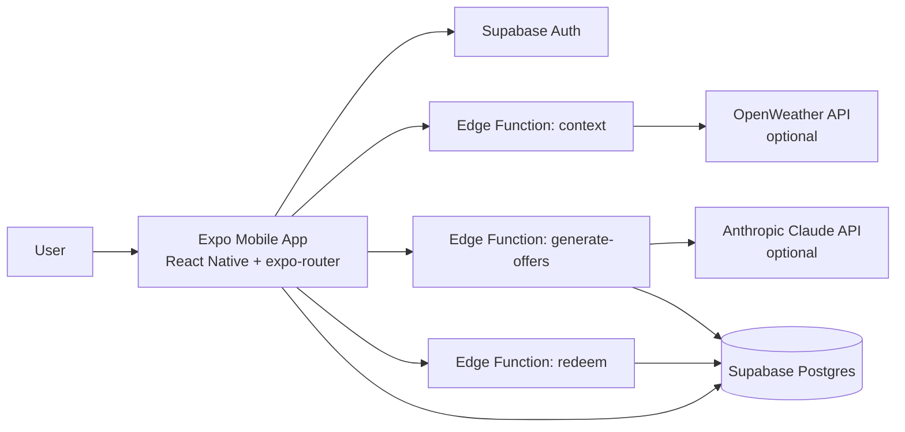

# Swocal —- Swipe Local

> *Mia is cold, hungry, and has 12 minutes. She opens Swocal. The app already knows it's 11°C and overcast. It knows the café 80m away hasn't had a customer in 90 minutes. It generates — right now, just for her — "Cold outside? Your oat flat white is waiting. 15% off, next 2 hours only." She swipes right. The café fills a quiet slot. Everyone wins.*

**One sentence pitch:** Swocal is a Tinder for local commerce — real-time, context-aware offers that don't exist until the moment you need them. 

**Two sentence pitch:** The user feeds their personal preferences into the app using a Tinder like interface, swiping left and right on local businesses they may be interested in. On the other side of the app, the business owners fill the data from their business, and set conditions for coupon attribution. Based on the consumers personal preferences, on the rules set by businesses, and context data (weather, time, local events, calendar data from user, previous coupons used by user), AI automatically attributes short lived coupons to customers in order to incentivize customers to use the businesses.

Coupon rates are limited, on both sides : customers only get a set numbers of coupons a day, and businesses can set a monthly limit of coupons given out by their business.

Customers are given coupons in the form of QR code : those are time limited, usable in only one location, and are scanned and authentified by the business owner from their side of the app.

---

## System Design



Current implementation notes:
- Backend in this repo is Supabase Edge Functions (not Vercel `/api/*` routes).
- Implemented Edge Functions: `context`, `generate-offers`, `redeem`.
- `generate-offers` uses Claude when `ANTHROPIC_API_KEY` is present, otherwise template fallback.
- `context` uses OpenWeather when `OPENWEATHER_API_KEY` is present, otherwise mock fallback.
- Merchant dashboard code is not present in this repository.

**Privacy / GDPR:** User preferences live in AsyncStorage on-device. Only an abstract `intent_vector` (e.g. `{mood: "warm_comfort", budget: "mid"}`) hits the server — no PII, no raw location.

---

## Supabase Schema (as used by code)

```sql
create table merchants (
  id uuid primary key default gen_random_uuid(),
  name text,
  category text,                      -- "cafe" | "bakery" | "restaurant"
  address text,
  lat float, lng float,
  image_url text,                     -- Unsplash URL by category
  transaction_volume text default 'normal', -- "low"|"normal"|"high" (simulated Payone)
  rules jsonb                         -- {"max_discount": 20, "quiet_hours": ["10-12","14-16"]}
);

create table generated_offers (
  id uuid primary key default gen_random_uuid(),
  merchant_id uuid references merchants(id),
  user_id uuid references auth.users(id),
  headline text,                      -- "Cold outside? Your cappuccino is waiting."
  subline text,                       -- "15% off · 200m away · Next 2 hours"
  discount_percent int,
  context_signals jsonb,              -- {"weather":"overcast","temp":11,"time":"lunch"}
  token text unique default gen_random_uuid()::text,
  status text default 'active',       -- active | redeemed | expired
  expires_at timestamptz default now() + interval '2 hours',
  created_at timestamptz default now()
);

create table swipes (
  id uuid primary key default gen_random_uuid(),
  offer_id uuid references generated_offers(id),
  direction text,                     -- "left" | "right"
  user_id uuid references auth.users(id),
  created_at timestamptz default now()
);

create table redemptions (
  id uuid primary key default gen_random_uuid(),
  offer_id uuid references generated_offers(id),
  user_id uuid references auth.users(id),
  redeemed_at timestamptz default now()
);
```

### Seed Data

```sql
insert into merchants (name, category, address, lat, lng, image_url, transaction_volume, rules) values
('Café Mayer', 'cafe', 'Marktplatz 4, Stuttgart', 48.7784, 9.1800, 'https://images.unsplash.com/photo-1501339847302-ac426a4a7cbb?w=400', 'low', '{"max_discount": 20, "quiet_hours": ["10:00-12:00","14:00-16:00"]}'),
('Bäckerei Weber', 'bakery', 'Königstraße 12, Stuttgart', 48.7786, 9.1795, 'https://images.unsplash.com/photo-1509440159596-0249088772ff?w=400', 'low', '{"max_discount": 15, "quiet_hours": ["13:00-15:00"]}'),
('Thai Kitchen', 'restaurant', 'Gerberstraße 5, Stuttgart', 48.7775, 9.1810, 'https://images.unsplash.com/photo-1559314809-0d155014e29e?w=400', 'low', '{"max_discount": 25, "quiet_hours": ["11:00-13:00"]}'),
('Weinbar Schmidt', 'bar', 'Calwer Straße 21, Stuttgart', 48.7780, 9.1790, 'https://images.unsplash.com/photo-1510812431401-41d2bd2722f3?w=400', 'normal', '{"max_discount": 20, "quiet_hours": ["17:00-19:00"]}'),
('Süßes Eck', 'dessert', 'Schlossplatz 8, Stuttgart', 48.7788, 9.1805, 'https://images.unsplash.com/photo-1488477181946-6428a0291777?w=400', 'low', '{"max_discount": 30, "quiet_hours": ["14:00-17:00"]}');
```

---


## API Endpoints (implemented)

### `GET context` (Supabase function)

Returns current context state. Called on app open.

```ts
// Output:
{
  weather: { condition: "overcast", temp: 11, icon: "☁️" },
  time_of_day: "lunch",           // morning|lunch|afternoon|evening
  day_type: "weekday",
  timestamp: "2026-04-25T11:47:00",
  location: { city: "Stuttgart", lat: 48.7784, lng: 9.18 }
}
```

Uses OpenWeatherMap free tier. Stuttgart coords hardcoded for demo.

### `POST generate-offers` (Supabase function)

Ranking + generation. Called with user intent.

```ts
// Input:
{
  intent_vector: { mood: "warm_comfort", budget: "mid" },
  context: {
    weather: { condition: "overcast", temp: 11, icon: "☁️" },
    time_of_day: "lunch",
    day_type: "weekday"
  }
}

// Output: array of 3 generated offers
{
  offers: [{
    id: "uuid",
    token: "uuid-token",
    expires_at: "2026-04-25T13:47:00",
    headline: "Cold outside? Coffee's on.",
    subline: "15% off · 200m away · Next 2 hours",
    discount_percent: 15,
    merchant: {
      id: "uuid",
      name: "Café Mayer",
      category: "cafe",
      image_url: "...",
      distance_m: 200
    },
    source: "claude" // or "template"
  }]
}
```

**Ranking:** weather/category affinity + mood/category affinity + transaction volume + small random tie-breaker, then top 3 are generated.

**Claude prompt:**
```
Context: {weather}, {temp}°C, {time_of_day}, {day_type}
Merchant: {name}, category: {category}
Merchant rule: max {max_discount}% discount, goal: fill quiet hours
User mood: {mood}

Generate a hyper-local, emotionally resonant offer. Return JSON:
{ headline: string (max 8 words, emotional), subline: string (factual: X% off · Ym away · timing), discount_percent: number }
```

### `POST redeem` (Supabase function)

```ts
// Input: { token: "uuid-token" }
// Output success: { valid: true, already_redeemed: boolean, offer: {...} }
// Output error: { valid: false, reason: "unauthenticated" | "missing_token" | "not_found" | "wrong_user" | "expired" | "server_error" }
// Side effect: status = 'redeemed', inserts into redemptions
```

---

## Division of Labor (2 hours)

| Person | Hour 1 | Hour 2 |
|--------|--------|--------|
| **Storyteller** | Seed Supabase with 5 merchants + offer rules. Pitch deck outline. | Demo script, polish slides, rehearse 3-second UI moment |
| **Frontend** | Scaffold Expo app, navigation, onboarding (3 preference tiles) | Swipe card component (`react-native-deck-swiper`), coupon screen + QR |
| **Vibe coder** | Supabase client, `/api/context` (OpenWeatherMap), context bar component | Merchant dashboard (Vercel/Next.js), wire swipe → redemption flow |
| **Generalist** | `/api/generate-offers` (Claude API + ranking logic), Supabase schema deploy | `/api/redeem`, end-to-end wiring, make demo bulletproof |

---

## What to Fake

| Faked | How to frame it in pitch |
|-------|--------------------------|
| Payone transaction density | Pre-seeded `transaction_volume: "low"` in Supabase | "Simulated Payone feed — real integration uses webhooks" |
| User location/geofencing | Hardcode Stuttgart center coords | "Geofence triggers; using fixed demo location" |
| On-device SLM | Claude API call server-side | "Intent vector is anonymized before leaving device — GDPR compliant" |
| Push notifications | User opens app manually | "Notification layer sits here — FCM/APNs hook-in point" |
| Merchant image generation | Unsplash URL by category | "Image generation via DALL-E 3 in production" |

---

## Demo Script (5-minute flow)

1. **"Mia opens Swocal"** → Onboarding: she taps Coffee, Local food, Cozy spots
2. **Context bar appears** → ☁️ 11°C · Lunch break — call this out verbally
3. **First card loads** → Café Mayer, "Cold outside? Your cappuccino is waiting." — pause on the emotional headline
4. **Swipe right** → "It's a match!" animation → coupon screen with QR + "Generated for: ☁️ 11°C + Quiet afternoon" — *this is the magic moment*
5. **Switch to merchant view** → Show the rule editor ("max 20%, fill quiet hours") → "The AI did everything else"
6. **Close with numbers** → 17/24 swipe right = 71% acceptance vs 2-3% for traditional push coupons

**The line:** *"The offer doesn't exist until Mia needs it. The merchant set one rule. The AI did the rest."*

---

## Tech Stack

- **Mobile:** Expo + React Native
- **Backend/API:** Supabase Edge Functions (Deno)
- **Database:** Supabase (Postgres)
- **AI:** Claude API (Anthropic)
- **Weather:** OpenWeatherMap free tier
- **Merchant dashboard:** Not implemented in this repo

### Bootstrap commands

```bash
# Mobile app
npx create-expo-app swocal --template tabs
cd swocal
npx expo install react-native-deck-swiper react-native-qrcode-svg @supabase/supabase-js expo-location

# Merchant dashboard
npx create-next-app merchant-dashboard --ts --app --tailwind
```


### Design

Fetch this design file, read its readme, and implement the relevant aspects of the design. https://api.anthropic.com/v1/design/h/Ki7xdTOZu5Eoup2ZnY0epA
Implement: the designs in this project

Assets:

https://claude.ai/design/p/71b41ff4-7c42-466a-9319-513a3d864376?via=share
