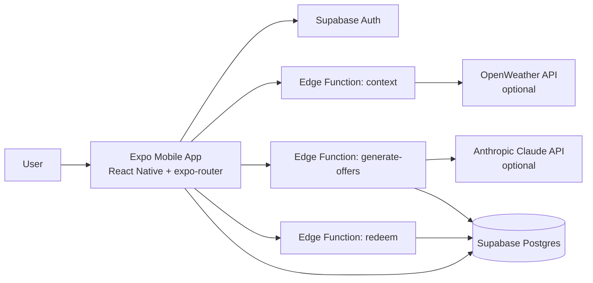

# Swocal — Swipe Local

> *Mia is cold, hungry, and has 12 minutes. She opens Swocal. The app already knows it's 11°C and overcast. It knows the café 80m away hasn't had a customer in 90 minutes. It generates — right now, just for her — "Cold outside? Your oat flat white is waiting. 15% off, next 2 hours only." She swipes right. The café fills a quiet slot. Everyone wins.*

**One sentence pitch:** Swocal is a Tinder for local commerce — real-time, context-aware offers that don't exist until the moment you need them. 

**Two sentence pitch:** The user feeds their personal preferences into the app using a Tinder like interface, swiping left and right on local businesses they may be interested in. On the other side of the app, the business owners fill the data from their business, and set conditions for coupon attribution. Based on the consumers personal preferences, on the rules set by businesses, and context data (weather, time, local events, calendar data from user, previous coupons used by user), AI automatically attributes short lived coupons to customers in order to incentivize customers to use the businesses.

Coupon rates are limited, on both sides : customers only get a set numbers of coupons a day, and businesses can set a monthly limit of coupons given out by their business.

Customers are given coupons in the form of QR code : those are time limited, usable in only one location, and are scanned and authentified by the business owner from their side of the app.

---

## System Design

Current implementation notes:
- Backend in this repo is Supabase Edge Functions (not Vercel `/api/*` routes).
- Implemented Edge Functions: `context`, `generate-offers`, `redeem`.
- `generate-offers` uses Claude when `ANTHROPIC_API_KEY` is present, otherwise template fallback.
- `context` uses OpenWeather when `OPENWEATHER_API_KEY` is present, otherwise mock fallback.
- Merchant dashboard code is not present in this repository.

**Privacy / GDPR:** User preferences live in AsyncStorage on-device. Only an abstract `intent_vector` (e.g. `{mood: "warm_comfort", budget: "mid"}`) hits the server — no PII, no raw location.

**Ranking:** weather/category affinity + mood/category affinity + transaction volume + small random tie-breaker, then top 3 are generated.

---

## Tech Stack

- **Mobile:** Expo + React Native
- **Backend/API:** Supabase Edge Functions (Deno)
- **Database:** Supabase (Postgres)
- **AI:** Claude API (Anthropic)
- **Weather:** OpenWeatherMap free tier
- **Merchant dashboard:** Not implemented in this repo

