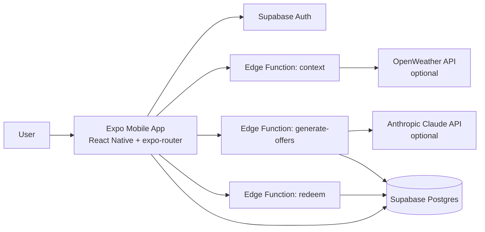
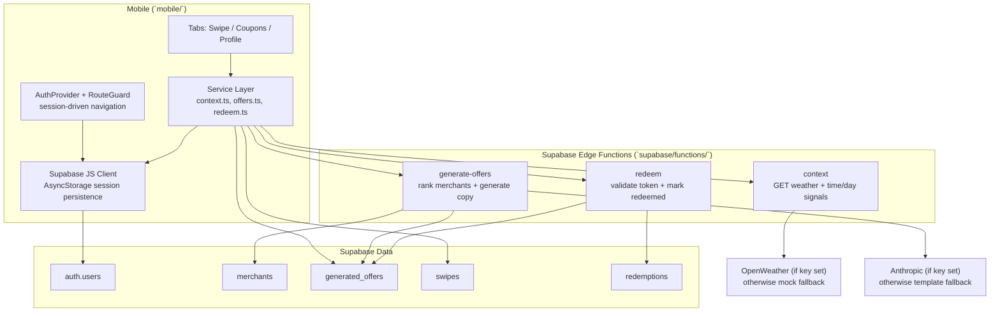

# Swocal — Technical Overview (Updated)

This document updates the technical sections using the current implementation in this repository (mobile app + Supabase Edge Functions).

## Executive Architecture Diagram

## Deep Technical Flow Diagram

## What Is Actually Implemented

- Mobile stack is Expo + React Native + TypeScript, with `expo-router` file-based routes.
- Auth is Supabase Auth, managed by `AuthProvider`, with route protection in `mobile/app/_layout.tsx`.
- Backend is implemented as Supabase Edge Functions (not Vercel endpoints in this repo):
  - `context`
  - `generate-offers`
  - `redeem`
- Offer generation stores records in `generated_offers`; swipe events are stored in `swipes`.
- Redeem flow validates user ownership + expiry, updates offer status, and writes to `redemptions`.
- Merchant dashboard code is not present in this repository.

## Runtime Components

### Mobile App

- Root composition:
  - `GestureHandlerRootView`
  - `AuthProvider`
  - `ThemeProvider`
  - `RouteGuard`
- Auth routes:
  - `/(auth)/login`
  - `/(auth)/signup`
- Main routes:
  - `/(tabs)/index` (Swipe UI)
  - `/(tabs)/coupons`
  - `/(tabs)/profile`

### Service Layer (mobile)

- `fetchContext()` invokes Edge Function `context`.
- `generateOffers(intent, context)` invokes `generate-offers`.
- `recordSwipe({ offerId, direction, userId })` inserts into `swipes`.
- `listMyOffers()` reads from `generated_offers` with joined `merchants`.
- `redeemToken(token)` invokes `redeem`.

### Supabase Client Configuration

The app creates a typed Supabase client with:

- `autoRefreshToken: true`
- `persistSession: true`
- `detectSessionInUrl: false`
- storage via `@react-native-async-storage/async-storage`

## Edge Functions

### 1) `context`

- Returns:
  - weather (`condition`, `temp`, `icon`, `source`)
  - `time_of_day` (`morning|lunch|afternoon|evening`)
  - `day_type` (`weekday|weekend`)
  - timestamp + fixed Stuttgart location
- Uses OpenWeather API if `OPENWEATHER_API_KEY` is set.
- Falls back to deterministic mock values when key is missing or request fails.

### 2) `generate-offers`

- Requires authenticated user from Supabase auth context.
- Input body:
  - `intent_vector` (optional mood/budget)
  - `context` (optional; defaults provided if omitted)
- Loads merchants from `merchants`.
- Scores and ranks merchants using:
  - weather/category affinity
  - intent/category affinity
  - `transaction_volume`
  - small random tie-breaker
- Selects top 3 merchants.
- Generation path:
  - With `ANTHROPIC_API_KEY`: structured JSON generation with Claude schema
  - Without key or on failure: template-based fallback
- Persists all generated rows in `generated_offers`.
- Returns enriched offer payload including `token`, `expires_at`, merchant metadata, and source.

### 3) `redeem`

- Requires authenticated user.
- Input: `{ token }`.
- Reads offer from `generated_offers` by token.
- Validates:
  - token exists
  - offer belongs to current user
  - offer not expired
  - status handling for already redeemed vs active
- On valid active offer:
  - updates `generated_offers.status` to `redeemed`
  - inserts redemption row in `redemptions`
- Returns typed success/failure payload (`valid`, `reason`, optional message).

## Data Model (Observed from Code)

The following tables are directly referenced by code:

- `merchants`
- `generated_offers`
- `swipes`
- `redemptions`

Important fields inferred from function/query usage:

- `generated_offers`: `id`, `token`, `user_id`, `merchant_id`, `headline`, `subline`, `discount_percent`, `context_signals`, `status`, `expires_at`
- `merchants`: `id`, `name`, `category`, `address`, `lat`, `lng`, `image_url`, `transaction_volume`, `rules`
- `swipes`: at least `offer_id`, `direction`, `user_id`
- `redemptions`: at least `offer_id`, `user_id`

## API Contract Snapshot (App-Side Types)

From `mobile/types/api.ts`:

- `ContextResponse`
  - weather + `time_of_day` + `day_type` + `timestamp` + `location`
- `GenerateOffersResponse`
  - `offers: GeneratedOffer[]`
- `RedeemResponse`
  - union type for valid/invalid redemption outcomes

## Environment Variables

### Mobile (public Expo vars)

- `EXPO_PUBLIC_SUPABASE_URL`
- `EXPO_PUBLIC_SUPABASE_ANON_KEY`

### Edge/runtime secrets

- `SUPABASE_URL`
- `SUPABASE_ANON_KEY`
- `SUPABASE_SERVICE_ROLE_KEY` (commonly provisioned; not used directly in these functions)
- `OPENWEATHER_API_KEY` (optional)
- `ANTHROPIC_API_KEY` (optional)

## Key Differences vs Older/Deprecated Docs

- Backend in this repo is Supabase Edge Functions, not Vercel `/api/*`.
- Mobile app currently renders local sample card/coupon UI data in tab screens; service functions are implemented and ready for wiring/expansion.
- Redeem is user-bound (`wrong_user` validation), not a generic public token redemption.
- Offer generation already includes fallback behavior when external APIs are unavailable.
- Merchant dashboard implementation is out of scope for this repository state.

## Suggested Slide Narrative (Technical)

1. Mobile app captures lightweight intent and user actions.
2. Context function enriches state with weather/time signals.
3. Offer function ranks merchants and generates constrained copy (LLM or template fallback).
4. Offers are persisted with short-lived tokens for redemption.
5. Redemption is strictly validated against auth, ownership, and expiry.
6. Swipe + redemption events close the loop for future optimization.
