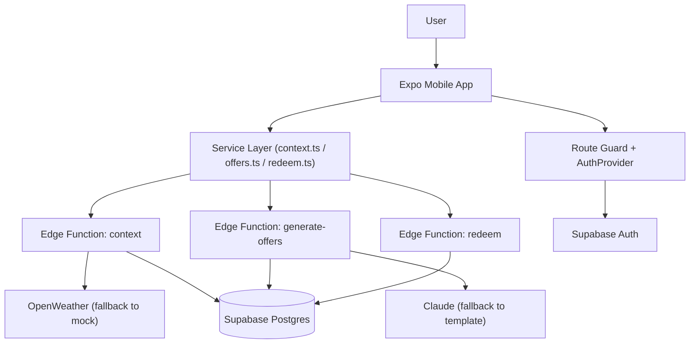
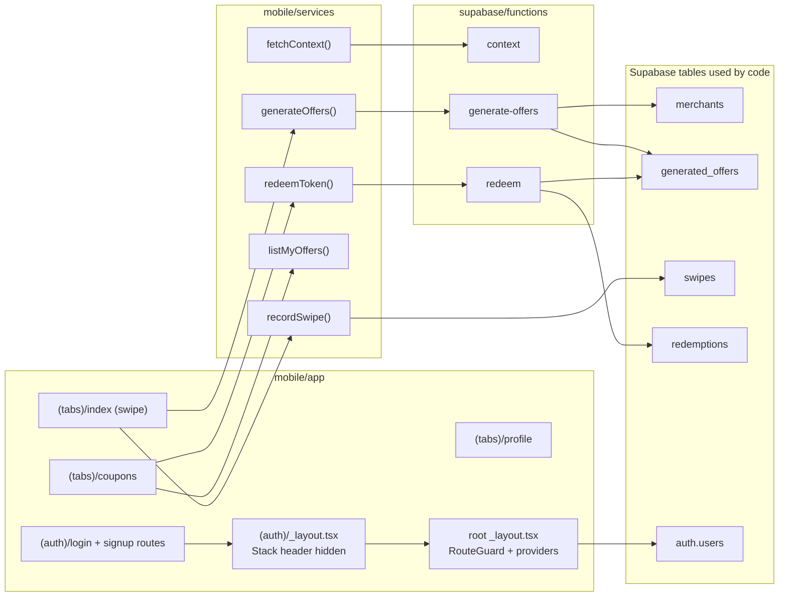

# Swocal Graphs (Stack, Architecture, Implementation)

Use these directly in your presentation where Mermaid is supported.

## 1) Tech Stack Graph

```mermaid
flowchart LR
  subgraph Mobile["Mobile App"]
    M1["Expo"]
    M2["React Native + TypeScript"]
    M3["expo-router"]
    M4["Supabase JS Client"]
    M5["AsyncStorage Session Persistence"]
  end

  subgraph Backend["Backend"]
    B1["Supabase Edge Functions (Deno)"]
    B2["context"]
    B3["generate-offers"]
    B4["redeem"]
  end

  subgraph Data["Data Layer"]
    D1["Supabase Auth"]
    D2["Supabase Postgres"]
  end

  subgraph Integrations["Optional External Services"]
    X1["OpenWeather API"]
    X2["Anthropic Claude API"]
  end

  M1 --> M2 --> M3 --> M4 --> D1
  M4 --> B1
  B1 --> B2
  B1 --> B3
  B1 --> B4
  B2 --> X1
  B3 --> X2
  B2 --> D2
  B3 --> D2
  B4 --> D2
```

## 2) Runtime Architecture Graph

## 3) Implementation Graph (What Exists in Repo)

